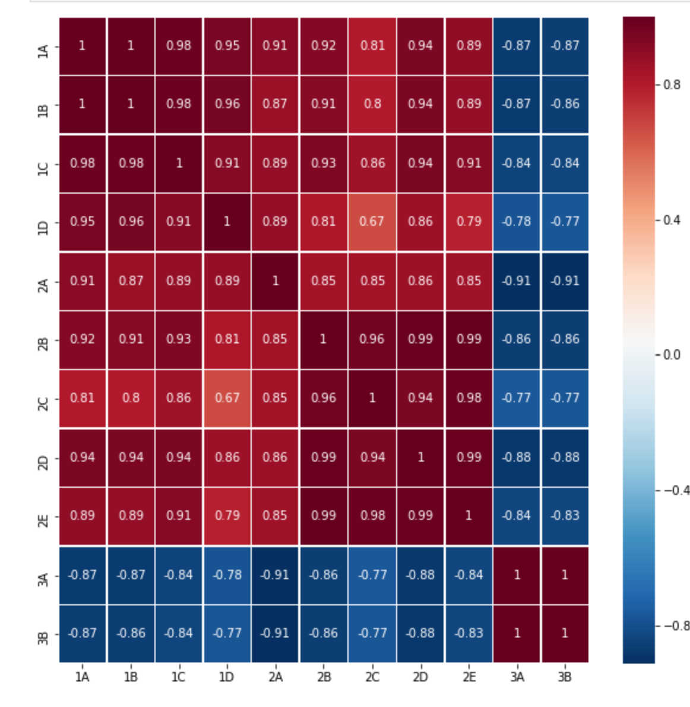

# Next Gate Tech Technical Test

## Introduction

This repository was made as part of my application to the company [Next Gate Tech](https://nextgatetech.com/). It includes my take on the technical test that was sent to me on February 28th, 2020.
The test's description can be found under *others/NGT - Test.pdf*
The actual files answering the questions can be found in the folder *case_study*.

- **Task A: Back-end** can be found in the folder *case_study/backend*.
- **Task B: Front-end** can be found in the folder *case_study/frontend*.
- **Task C: Cloud Functions** can be found in the folder *case_study/cloud*.

Some others folders can also be found in this repository:

- *case_study/data* that contains the data used in the project, including the given csv file given with the test (*example_data.csv*).
- *case_study/identification* that contains the files for identification with the Google Cloud Plateform.
- *others* contains different files that are not relevant to the project but that I included for more transparency on my take on this test.

## Task A: Back-end

This part was answered using a *jupyter notebook*  that allowed for an easier data exploring, comprehension and communication with *Firestore*.

The *jupyter notebook* already contains step by step explanation on the process.

*Python 3.7* and the library *pandas* were used.
The dataset had the following schema, I also included my interpretation of the column.

|Column name|Interpretation|
|--|--|
|Subfund_Code|Subfund_Code|
|Share_Class_Code|Share_Class_Code|
|Valuation_Date|Date of the valuation of the different variables of the following columns|
|Subfund_CCY|Currency Code used for the Subfund|
|Net_Asset_Value|Value of the asset as of *Valuation_Date*'s date|
|Nb_Shares_Outstanding|All **shares** currently owned by stockholders, company officials, and investors in the public domain|
|NAV_Per_Share|Net Asset Value Per Share|
|CCY_NAV_share|Currency code used for the *NAV_Per_Share*|
|ISIN_Code|International Securities Identification Number|
|Nb_Shares_Subscribed|Number of shares subscribed for this instrument on *Valuation_Date*'s date|
|Amount_Subscribed|Nb_Shares_Subscribed x Net_Asset_Value|
|Nb_Shares_Redeemed|Number of shares redeemed for this instrument on *Valuation_Date*'s date|
|Amount_Redeemed|Nb_Shares_Redeemedx Net_Asset_Value|
|Subfund_Long_Name|**Always NaN**|
|Dividend_Per_Share|Dividend that the fund should receive per share|
|Dividend_Payment_Date|Date at which the dividends should be paid|
|Dividend_PCCY|**Always 0**|
|Dividend_Payment_CCY|Currency code of the dividend payment|
|Dividend_Subfund_CCY|Currency code of the dividend subfund|
|Total_Net_Assets|Total net assets of this instrument|

The following checks were made:

- There is only one row per instrument and NAV_Per_Share
- For each valuation date **NAV_Per_Share=Total_Net_Assets/Nb_Shares_Outstanding** (with a 2% error margin)

We also calculated the correlation for each instruments between each other, here is the pearson correlation matrix of the different instruments:

## Task B: Front-end

To gain a bit of time for this part, I have used an already existing open source Angular 8 template that I have simplified and adapted to my own usage.
The template used is [black-dashboard-angular](https://github.com/creativetimofficial/black-dashboard-angular) (under MIT License).

INCLUDE SCREENSHOTS

## Task C: Cloud functions
